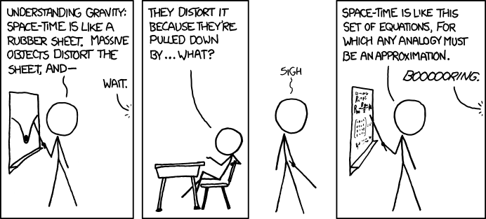
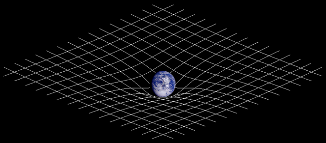
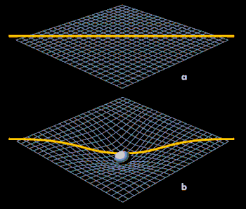
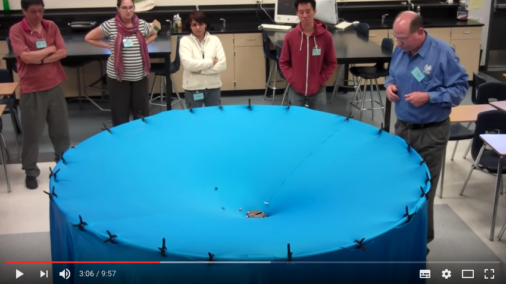

# Why gravity and speed are slowing down time?

Maybe you watched Interstellar or one of your friend told you about it and you didn't get it. 

> If you travel at speed of light time slows down

or maybe

> If you go next to a black hole and come back, you'll still be the same age while most of the people you know would be dead

Yes, it is true! However, this usually follows with a long and complicated discussion...

This article attempts to explain this in a simple way.

## The basics

## Speed of light

Light travels exactly at 300 million meters per second in every direction, the speed of light is the speed of light no matter what.

Just to give you a more meaningful representation this is **186,000 miles per second** or **1.07 billion km per hour**

To put that in perspective, if you could travel at the speed of light, you would be able to go around Earth in approximately seven and a half times in one second.

Yes, that's how fast it is.

### What am I supposed to understand? 

> The light is **fast**. So fast it is difficult to understand in our daily life that when something happens we don't have the information immediately but with a small delay, the time for the light to reach our eye.

## Relativity

Imagine the following situation.

You stand on the side of the highway with a speed radar and measure the speed of a car. You record 100km/h.

Then, you jump into your car and drive at 80km/h.

You measure exactly the same car again and you record 20km/h.

### What am I supposed to understand? 

> There is no absolute speed. The speed of an object is relative to another object. In that case, you and the other car.

## Time

We all have relativistic views of "time". It's not really a thing out in space away from us, because it's an invention of mankind.

Time has no meaning or context without human perspective.

### What am I supposed to understand? 

> It's hard to imagine time behaving in a different way since we are experimenting time exclusively on Earth.

## Spacetime

The word "spacetime" comes from the concept of the 4-dimensional universe. You have width, depth and height, and then all matter exists within time as well. So spacetime just means space and time.

### What am I supposed to understand? 

> You're not moving only in space but in space and time simultaneously. 

# How speed is affecting time?

Remember the car example? The tricky thing with time dilation is that when we say time is going "slower" or "faster," what we're talking about is someone else's perspective

If you ran 100 meters in 1 minute, you would have moved of 100 meters in space **and** 1 minute in time.

On the other hand, while you are reading this, you're not moving in space, but time is still flying. So you're moving only in time, not space.

Then you decide to do some exercise and go for a run.
You are still moving in time, but now also moving in space. Because time and space are not 2 separated things and depends of each other, one or the other has to slow down. 

You are moving in space, time has to slow down.

> Because space and time are linked, the faster you move through space, the slower time appears to go

However, the effect isn't noticeable on our scale because we're all moving through space at about the same relative speed -- we're all on the same planet, traveling in the same direction, and measuring ourselves against the same sun, moon and solar system

> Long story short, we are moving in time **AND** space. 

> Your space + time movement can never exceed 1.
> As you speed up, your time movement must slow.

# How gravity is affecting time?

Information can only travel through space at the speed of light.

When you are looking at fireworks, the rocket explodes and the light is traveling through space to your eye. It's only when the light hits your eye that you get the information: "The rocked has exploded"

> Gravity bends space and information can only travel through space at the speed of light
> 
> A black hole stretched and bent space with gravity, so you're now going faster through that space and slower through time.

> _Two-dimensional projection of a three-dimensional analogy of spacetime curvature described in general relativity_

> _The yellow line is "longer" on the second representation because the space is "bended" so the light take more time to reach Earth_

To understand gravity I recommend watching this video

> _Gravity Visualized_

# I kind of understood but ... not really

Explaining this in detail requires math. 

To truly grasp these concepts, you need to understand the math that defines them. At best, a non-mathematical description is only an approximation with the comparison of one thing with another thing of a different kind.

To begin with, have a look at the mathematical relationship between mass and energy.

# Sources

https://en.wikipedia.org/wiki/Spacetime

https://en.wikipedia.org/wiki/Theory_of_relativity

https://en.wikipedia.org/wiki/Special_relativity

https://en.wikipedia.org/wiki/General_relativity

https://en.wikipedia.org/wiki/Time#Physical_definition

https://www.reddit.com/r/explainlikeimfive/comments/3176uk/eli5_time_dilation_and_gravational_time_dilation/

https://www.reddit.com/r/explainlikeimfive/comments/1pmuky/eli5_why_does_gravity_dilate_time/

http://www.circlon.com/living-universe/020-einstein-gravity-time-dilation.html

http://www.universetoday.com/38040/speed-of-light-2/

http://jac_leon.perso.neuf.fr